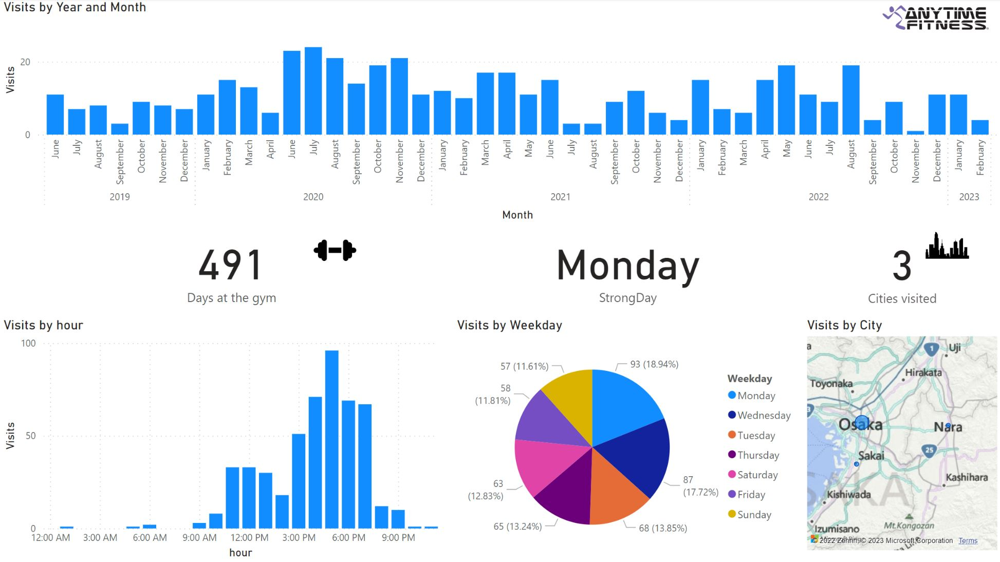
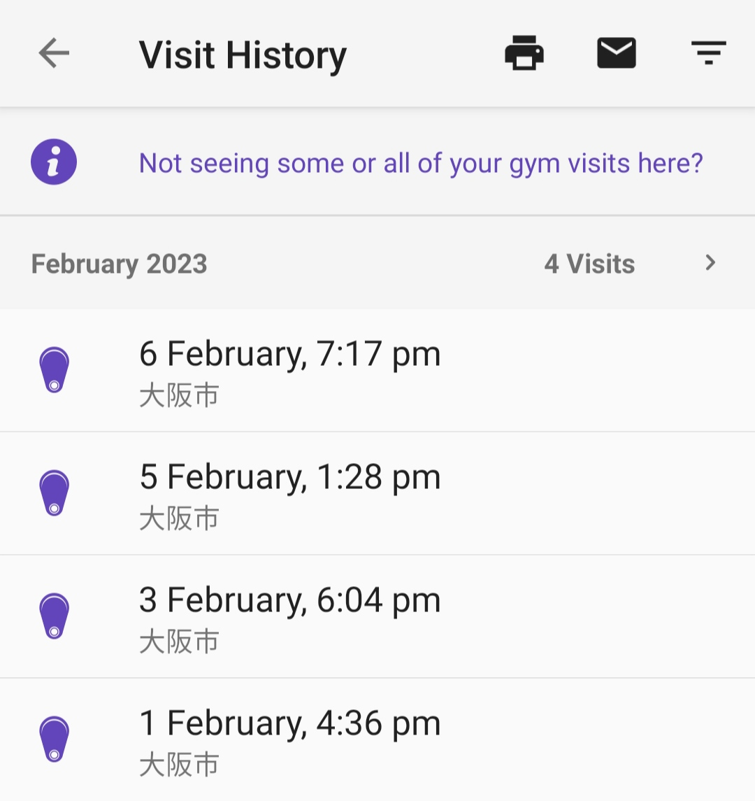

<p align="center">
    
</p>

# dashboard from the AF pdf from mobile app

## tree structure

```
 AFdash
├──  assets                                    <-- pictures for report and repo
├──  data
│  ├──  1_raw
│  │  └──  Anytime Fitness Visits & Tans.pdf   <-- pdf from mobile app
│  ├──  2_processed
│  │  └──  AF_history.csv                      <-- csv after python script (notebook)
│  ├──  3_report
│  │  └──  AF_history.pbix                     <-- pbi report
│  └──  AF_history.ipynb                       <-- notebook (pdf to csv)
├──  LICENSE
└──  README.md
```

## how to use

<p align="center">
    
</p>

1. get the pdf file from mobile app and put it in `/data/1_raw`
2. run the notebook `/data/AF_history.ipynb`
3. open `data/3_report/AF_history.pbix`
4. change the source for AF_history


